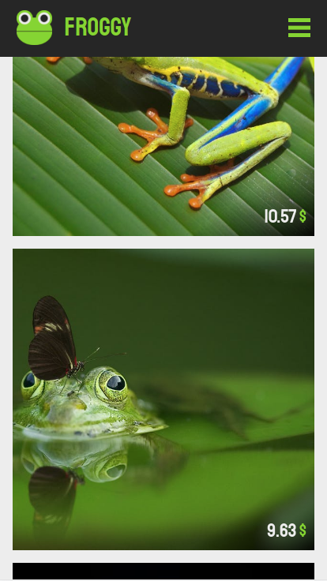

# Froggy  

This is a simple e-commerce front-end page created with create-react-app. You can take a look at the live version [here](https://hebliscode.github.io/Froggy/#/)  

## Overview  

The app is structured with react-router-dom. There are two parts: the navbar and the main. The navbar is rendered in every single route while the main holds the content of the selected route.
Every page and component is styled using the styled-components library using a mobile first approach.
All the animations are achieved using the react-spring library, usually using the useSping and useTransitions hooks.
Since I didn't have access to a real shopping catalog, the app fetches some images from the pexel API and uses those as "items" to sell, evaluating a price based on the image id number. 

## Technologies and libraries

- React
- styled-components
- react-spring
- react-router-dom
- pexel API
- figma

## How I built it  

The first step was creating a mockup of the page using figma (you can find it [here](https://www.figma.com/file/hl4ZKRIcodqf8NFwqorMVu/ShoppingCart?node-id=0%3A1)). After that I've set up the routes, the transitions and styled the navbar. Once that was done I started working on the single pages (home, shop...) making a static version first and adding all the functionality later.
The whole cart logic can be found inside the useShoppingCart hook which saves the items with a useState hook and returns an object with methods to update the state.
I've tried to structure everything in a way that makes it easy to add/remove a page from the app.  

## Screenshots  

### Mobile  

    
    
    
    

### Desktop  

   
   
   
